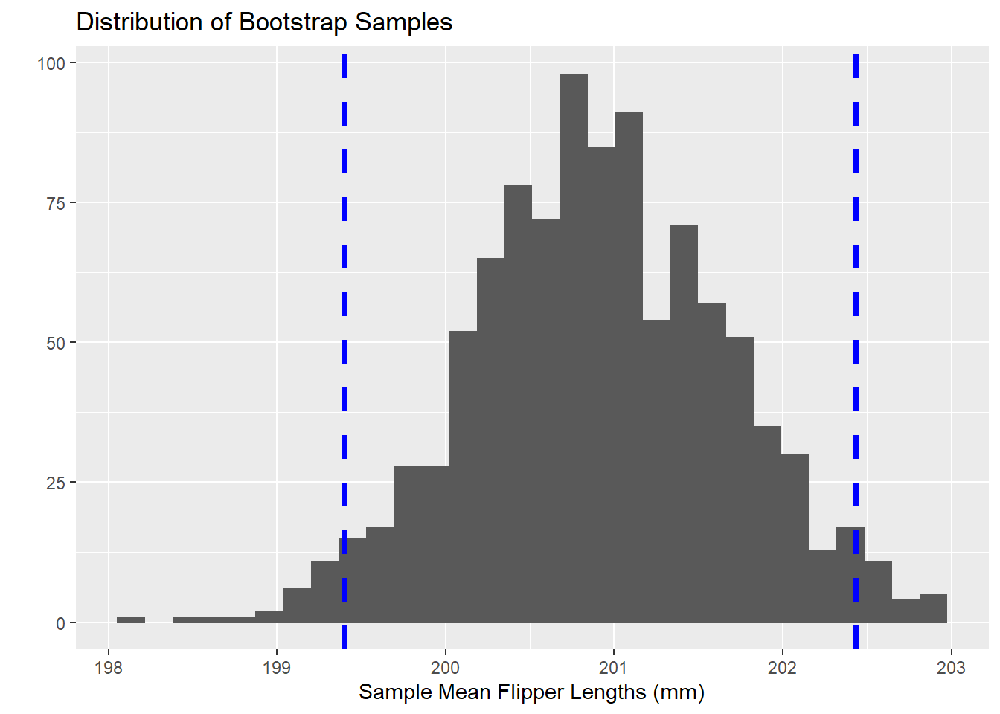

**Objectives:** In this notebook we'll be reminded of classical inference techniques built on the Central Limit Theorem. We'll also address bootstrapping methods and how statistical inference can still be made from data even if we refuse to assume the Central Limit Theorem. We'll attempt some statistical inferences using these bootstrapping techniques and our `penguins` data.

## Classical Statistics versus Simulation-Based Methods

In your introductory statistics courses, you spent lots of time using confidence intervals and hypothesis tests to make or test claims about populations by using sample data. Those are really powerful tools, but you saw them in a fairly restrictive environment -- that entire course assumed that the underlying sampling distribution was nearly normal. While this is often the case, it isn't always a reasonable assumption -- particularly in the case of small sample sizes or extremely skewed metrics. We'll recap those classical approaches and introduce simulation-based methods in this notebook.

### Classical Approaches: A Reminder

In Classical Statistics, we assume the Central Limit Theorem. That Theorem guarantees that the sampling distribution (the distribution of summary statistics for *all* samples of our size from the population) is approximately Normal. This allows us to

+ Use critical values from a *Normal* or *t*-distribution when building confidence intervals. As a reminder, confidence intervals are constructed using the following formula:
$$\left(\text{point\_estimate}\right) \pm \left(\text{critical\_value}\right)\left(\text{standard\_error}\right)$$
+ Compute $p$-values using a test statistic and then computing a $p$-value using a *Normal* or *t*-distribution. As a reminder, our test statistics were computed as follows:
$$\text{test\_statistic} = \frac{\left(\text{point\_estimate}\right) - \left(\text{null\_value}\right)}{\text{standard\_error}}$$

While the Central Limit Theorem often applies, we can't always assume it. Simulation techniques are helpful in those situations.

### Simulation-Based Methods

If we are in a scenario where we are unable to assume that our underlying sampling distribution is nearly normal, then we'll need another technique. Essentially, by refusing to assume that the sampling distribution is nearly normal, we concede that any $p$-value we find, or confidence intervals we build will be untrustworthy. As long as we are willing to assume that our sample data is *random* and *representative* of the population, then we can use simulation techniques to find $p$-values and generate confidence intervals.

#### Bootstrapping

As long as we are comfortable assuming that our sample data is *random* and *representative* of our population, then we can treat our sample data as if it were a population. We can then redraw samples of the same size out of it. We can do this over and over again, computing our sample statistic for each redrawn (*bootstrapped*) sample. Let's see that in action below, using our full `penguins` data.


::: {.cell}

```{.r .cell-code}
n_samps <- 1000
sample_means <- rep(NA, n_samps)
for(i in 1:n_samps){
  my_samp <- penguins %>%
    sample_n(nrow(penguins), replace = TRUE)
  sample_means[i] <- my_samp %>%
    summarize(mean = mean(flipper_length_mm, na.rm = TRUE)) %>%
    pull(mean)
}

ggplot() +
  geom_histogram(aes(x = sample_means)) +
  labs(title = "Distribution of Bootstrap Samples",
       x = "Sample Mean Flipper Lengths (mm)",
       y = "")
```

::: {.cell-output .cell-output-stderr}
```
`stat_bin()` using `bins = 30`. Pick better value with `binwidth`.
```
:::

::: {.cell-output-display}
{width=672}
:::
:::


Through this process, we've built our own sampling distribution which isn't beholden to the normality assumption.

##### Bootstrapping a Confidence Interval

Now that we've bootsrapped $1000$ sample means of flipper lengths, we can find the cutoff for the shortest $2.5$% of sample means and the longest $2.5$% of sample means -- that is, we look for the $2.5^{th}$ percentile and the $97.5^{th}$ percentile. The resulting interval between those two percentiles is a $95$% confidence interval. Let's do that with our bootstrapped sample results from above.


::: {.cell}

```{.r .cell-code}
quantile(sample_means, c(0.025, 0.975))
```

::: {.cell-output .cell-output-stdout}
```
    2.5%    97.5% 
199.4006 202.4362 
```
:::
:::


We can now claim, with $95$% confidence, that the population mean flipper length for penguins falls somewhere between 199.4mm and 202.44mm. Visually, what we've done appears below -- with the confidence interval bounds represented by the two vertical dashed lines.


::: {.cell}

```{.r .cell-code}
ggplot() +
  geom_histogram(aes(x = sample_means)) +
  geom_vline(aes(xintercept = quantile(sample_means, 0.025)),
             color = "blue",
             lwd = 1.5,
             linetype = "dashed") +
    geom_vline(aes(xintercept = quantile(sample_means, 0.975)),
             color = "blue",
             lwd = 1.5,
             linetype = "dashed") +
  labs(title = "Distribution of Bootstrap Samples",
       x = "Sample Mean Flipper Lengths (mm)",
       y = "")
```

::: {.cell-output .cell-output-stderr}
```
`stat_bin()` using `bins = 30`. Pick better value with `binwidth`.
```
:::

::: {.cell-output-display}
{width=672}
:::
:::


Note that all of your confidence intervals from your introductory statistics work are symmetrical. Confidence intervals resulting from the Bootstrapping process are not necessarily symmetric. This means that Bootstrapped confidence intervals are particularly well-suited to data and populations which may be skewed!

#### Hypothesis Tests for Single Group Parameters

We can also use this Bootstrapping procedure as an alternative to the classical null hypothesis testing framework. Here, we'll be testing whether our sample was drawn from a population having a particular assumed/null distribution by Bootstrapping samples and sample statistics from that assumed population distribution and comparing our sample statistic to the distribution of bootstrapped sample statistics. 

For example, perhaps we are wondering whether there is evidence to suggest that our penguin flipper lengths were pulled from a normal distribution whose mean is $200$mm and whose standard deviation is $5$mm. Let's draw $1000$ random samples of flipper lengths from this assumed population distribution, build the sampling distribution of mean flipper lengths, and then compare our sample to the Bootstrapped sampling distribution.


::: {.cell}

```{.r .cell-code}
num_samps <- 1000
bootstrapped_mean_lengths <- rep(NA, num_samps)

for(i in 1:num_samps){
  my_samp <- rnorm(nrow(penguins), 200, 5)
  bootstrapped_mean_lengths[i] <- mean(my_samp)
  }

my_mean_flipper_length <- penguins %>%
  summarize(mean = mean(flipper_length_mm, na.rm = TRUE)) %>%
  pull(mean)

ggplot() + 
  geom_histogram(aes(x = bootstrapped_mean_lengths)) +
  geom_vline(aes(xintercept = my_mean_flipper_length), 
             color = "blue",
             lwd = 1.5,
             linetype = "dashed") +
  labs(title = "Bootstrapped Hypothesis Test",
       subtitle = "Mean Flipper Length",
       x = "Bootstrapped Mean Flipper Lengths (~N(200, 5))",
       Y = "")
```

::: {.cell-output .cell-output-stderr}
```
`stat_bin()` using `bins = 30`. Pick better value with `binwidth`.
```
:::

::: {.cell-output-display}
{width=672}
:::
:::


Visually, we see that our sample is an outlier in the sampling distribution pulled from a population which is *normally distributed with mean $200$ and standard deviation $5$*. We can obtain a $p$-value for this Bootstrapped hypothesis test by counting the number of bootstrapped samples with sample statistics at least as extreme as ours and then dividing by the total number of Bootstrapped samples we constructed. As a reminder, if we are simply testing for a difference, we must multiply our $p$-value by $2$ to account for the idea that a difference can be *greater* or *less* than the assumed null value. Let's see that below:


::: {.cell}

```{.r .cell-code}
num_extreme <- sum(bootstrapped_mean_lengths >= my_mean_flipper_length)

bootstrapped_p_value <- 2*(num_extreme / num_samps)
bootstrapped_p_value
```

::: {.cell-output .cell-output-stdout}
```
[1] 0
```
:::
:::


Since we've obtained a Bootstrapped $p$-value below $0.05$, we have statistically significant evidence to suggest that our penguin flipper lengths do not come from a normal distribution with mean $200$mm and standard deviation $5$mm. Three things are possible here:

+ The population mean is truly different than $200$mm
+ The population standard deviation is truly greater than $5mm$
+ The overall population distribution is not a normal distribution at all

#### Permutation Tests for Group Comparisons

We can also use a Bootstrapping procedure for conducting two-sample comparison hypothesis tests. Perhaps we are wondering whether there is a difference in the mean flipper lengths for male and female penguins. We know that our sample `penguins` has the correct/meaningful assignment of each penguin's `sex`. This results in a group of male and female penguins whose average flipper length is a quantity we can compute. Once we have those average flipper lengths, we can subtract them to find the difference in mean flipper lengths between male and female penguins in our sample.

Next, we can permute (shuffle) the values in the `sex` column, creating a new grouping of the penguins which is not actually related to the `sex` of the penguins at all. Similarly, we can compute the average flipper length within each group and subtract those averages to find the difference in mean flipper length between the two groups. We can do this lots of times, obtaining lots of differences in average flipper lengths for which the `sex` variable is meaningless. Then, we can see whether our sample, where `sex` is a meaningful variable, is an outlier in this distribution of bootstrapped results.

Let's try it!


::: {.cell}

```{.r .cell-code}
my_female_avg_flipper_length <- penguins %>%
  filter(sex == "female") %>%
  summarize(mean = mean(flipper_length_mm, na.rm = TRUE)) %>%
  pull(mean)

my_male_avg_flipper_length <- penguins %>%
  filter(sex == "male") %>%
  summarize(mean = mean(flipper_length_mm, na.rm = TRUE)) %>%
  pull(mean)

my_difference <- my_male_avg_flipper_length - my_female_avg_flipper_length

#Bootstrap Permutations
num_samps <- 1000
independent_differences <- rep(NA, num_samps)

for(i in 1:num_samps){
  penguins_reassigned <- penguins %>%
    mutate(sex = sample(sex, nrow(penguins), replace = FALSE))
  
  fem_avg <- penguins_reassigned %>%
    filter(sex == "female") %>%
    summarize(mean = mean(flipper_length_mm, na.rm = TRUE)) %>%
    pull(mean)
  
  male_avg <- penguins_reassigned %>%
    filter(sex == "male") %>%
    summarize(mean = mean(flipper_length_mm, na.rm = TRUE)) %>%
    pull(mean)
  
  independent_differences[i] <- male_avg - fem_avg
}

ggplot() + 
  geom_histogram(aes(x = independent_differences)) +
  geom_vline(aes(xintercept = my_difference),
             color = "blue",
             lwd = 1.5,
             linetype = "dashed") +
  labs(title = "Permutation Test",
       subtitle = "Difference in Flipper Lengths by Sex",
       x = "Difference in Flipper Lengths (mm)",
       y = "")
```

::: {.cell-output .cell-output-stderr}
```
`stat_bin()` using `bins = 30`. Pick better value with `binwidth`.
```
:::

::: {.cell-output-display}
{width=672}
:::

```{.r .cell-code}
extreme_samples <- sum(independent_differences >= my_difference)
bootstrapped_p_value <- 2*(extreme_samples/num_samps)
bootstrapped_p_value
```

::: {.cell-output .cell-output-stdout}
```
[1] 0
```
:::
:::


The Bootstrapped $p$-value above indicates that our difference in average flipper lengths, where `sex` was a meaningful variable was an *extreme* outlier in the distribution of differences where `sex` was a truly meaningless variable. That is, there is evidence here to suggest a difference in mean flipper lengths across the two sexes of penguin.

***

## Your Tasks

+ Decide on another question you would like to test with the penguins dataset.
+ Write an alternative and null hypothesis that relates to your question.
+ Decide how you can adjust the code above to test your question using bootstrapping methods.
+ Conduct your analysis. Does the bootstrapping analysis support your hypothesis?
+ Be sure your analysis is well documented and described in your notebook. Again, envision your notebook as your methodology that you're sharing with the scientific community.
+ Use the `Pull -> Commit -> Push` workflow to publish your completed notebook to your GitHub repository.
