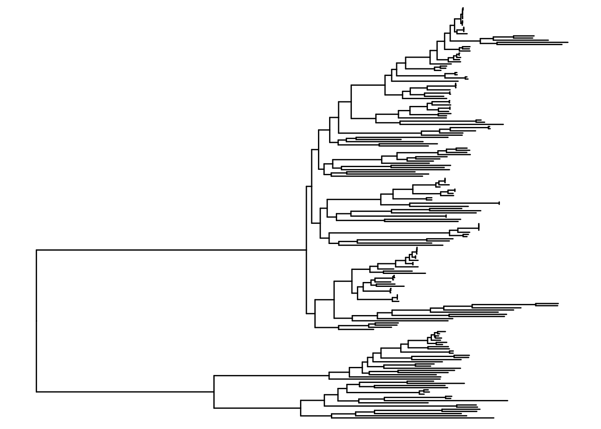
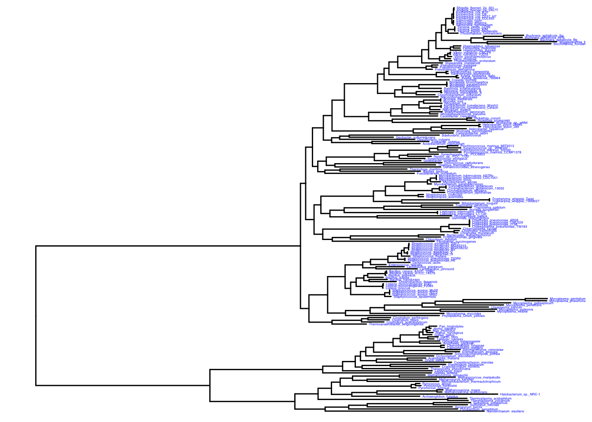
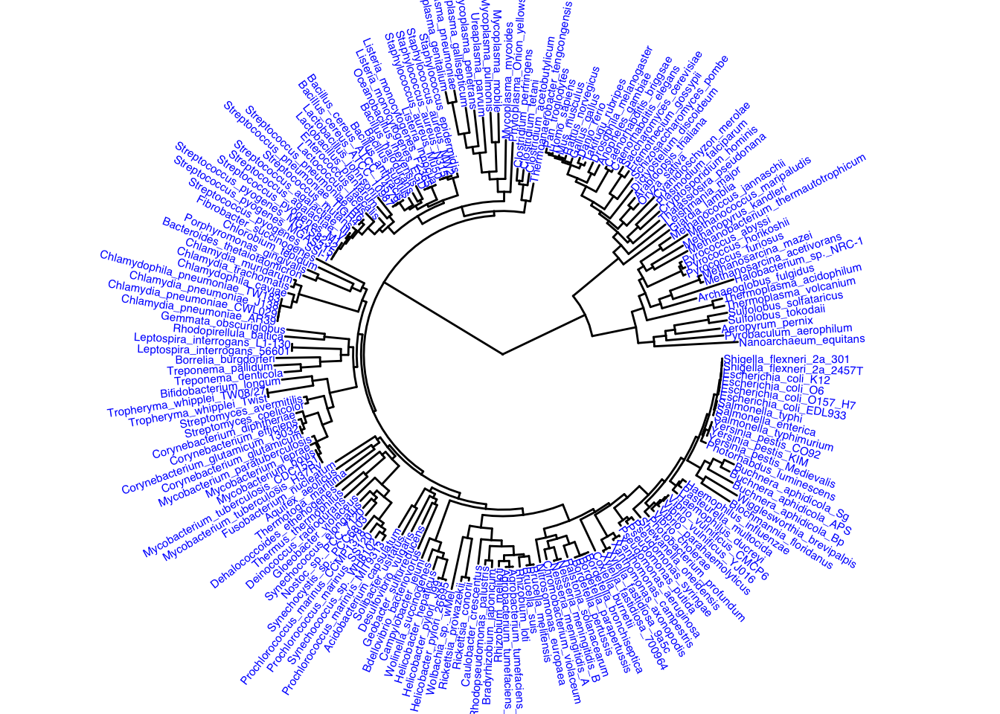
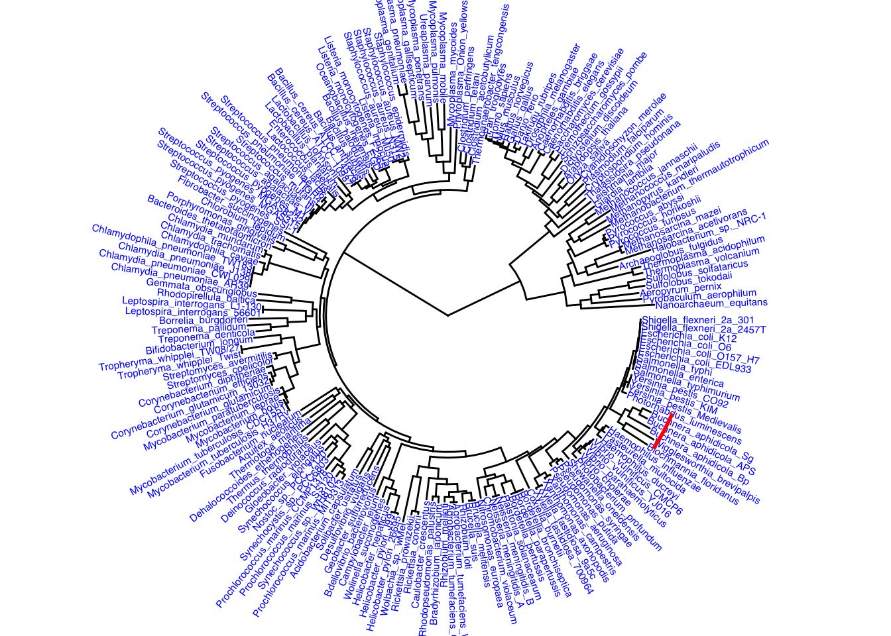
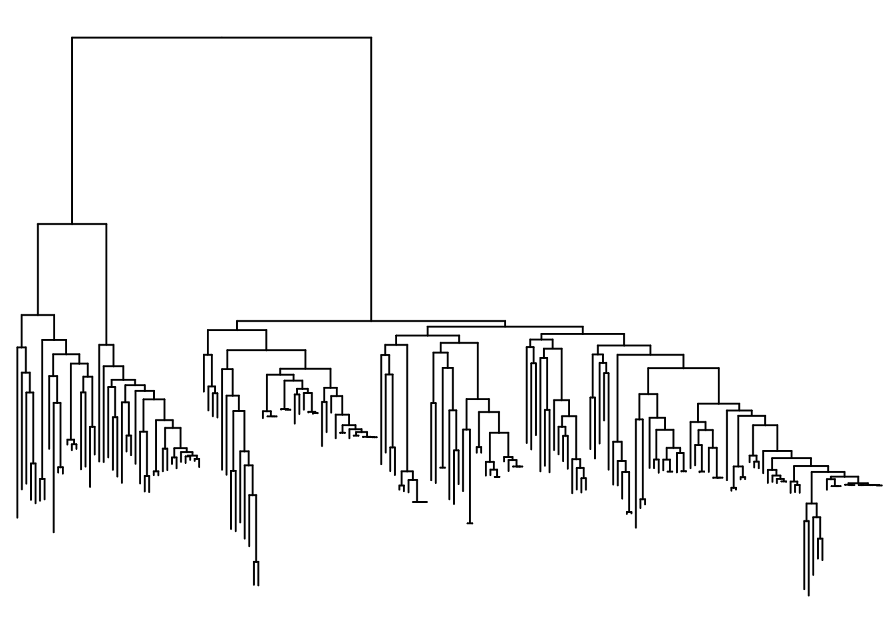
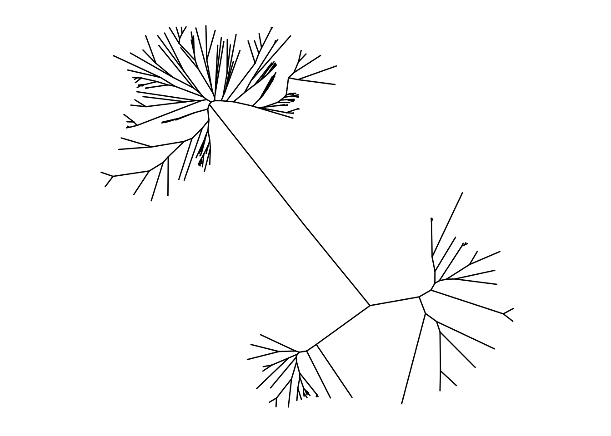
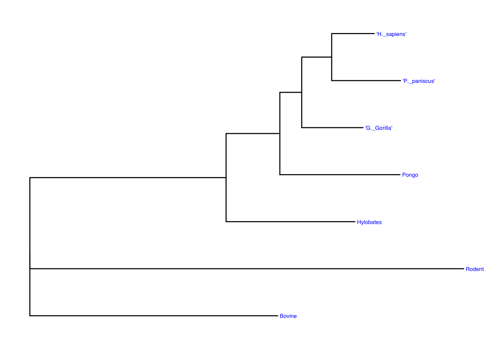
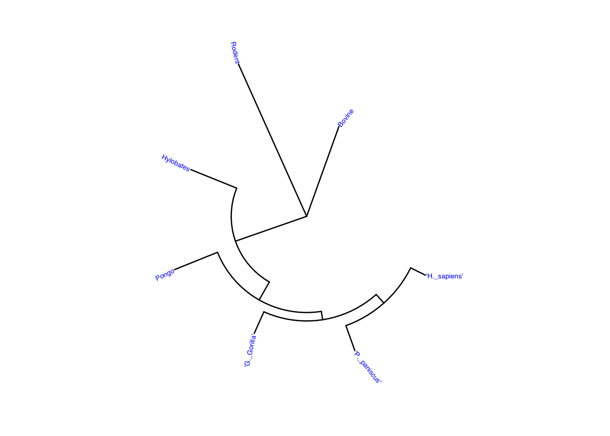

## Introduction

In this exercise, we will learn how to analyze genetic data to build phylogenies, or evolutionary trees. Evolutionary trees have been used to display relationships among organisms since Darwin first wrote *The Origin of Species*. They were originally made using morphological data (or physical traits) but are now typically made using genetic data and increasingly large genetic datasets. Once again, it's Bioinformatics to the rescue!

## Notebook Objectives

In this Notebook, you will:

-   create various formats of evolutionary trees using the packages `ape` and `treeio`

-   examine how `ggtree` can be used to create many different visualization for evolutionary trees

-   interpret the output of the programs and "read" an evolutionary tree

## New Document and Packages

Open a new Quarto document in your Bioinformatics project. Give your document a meaningful title like "Phylogenetic analysis and Visualization." Type a brief description and then start to install the new packages you will need. Remember to remove the "\#" the first time you run it and then replace it after the package downloads.


::: {.cell}

```{.r .cell-code}
#install.packages("ape")

#if (!require("BiocManager", quietly = TRUE))
    #install.packages("BiocManager")

#BiocManager::install("treeio")

#if (!require("BiocManager", quietly = TRUE))
    #install.packages("BiocManager")

#BiocManager::install("ggtree")

#if (!require("BiocManager", quietly = TRUE))
    #install.packages("BiocManager")

#BiocManager::install("SGSeq")
```
:::


Now, let's load all the packages we will need into our library. Some of them you have downloaded earlier.


::: {.cell}

```{.r .cell-code}
library(rbioinfcookbook)
library(SGSeq)
```

::: {.cell-output .cell-output-stderr}

```
Loading required package: IRanges
```


:::

::: {.cell-output .cell-output-stderr}

```
Loading required package: BiocGenerics
```


:::

::: {.cell-output .cell-output-stderr}

```

Attaching package: 'BiocGenerics'
```


:::

::: {.cell-output .cell-output-stderr}

```
The following objects are masked from 'package:stats':

    IQR, mad, sd, var, xtabs
```


:::

::: {.cell-output .cell-output-stderr}

```
The following objects are masked from 'package:base':

    anyDuplicated, aperm, append, as.data.frame, basename, cbind,
    colnames, dirname, do.call, duplicated, eval, evalq, Filter, Find,
    get, grep, grepl, intersect, is.unsorted, lapply, Map, mapply,
    match, mget, order, paste, pmax, pmax.int, pmin, pmin.int,
    Position, rank, rbind, Reduce, rownames, sapply, saveRDS, setdiff,
    table, tapply, union, unique, unsplit, which.max, which.min
```


:::

::: {.cell-output .cell-output-stderr}

```
Loading required package: S4Vectors
```


:::

::: {.cell-output .cell-output-stderr}

```
Loading required package: stats4
```


:::

::: {.cell-output .cell-output-stderr}

```

Attaching package: 'S4Vectors'
```


:::

::: {.cell-output .cell-output-stderr}

```
The following object is masked from 'package:utils':

    findMatches
```


:::

::: {.cell-output .cell-output-stderr}

```
The following objects are masked from 'package:base':

    expand.grid, I, unname
```


:::

::: {.cell-output .cell-output-stderr}

```
Loading required package: GenomicRanges
```


:::

::: {.cell-output .cell-output-stderr}

```
Loading required package: GenomeInfoDb
```


:::

::: {.cell-output .cell-output-stderr}

```
Loading required package: Rsamtools
```


:::

::: {.cell-output .cell-output-stderr}

```
Loading required package: Biostrings
```


:::

::: {.cell-output .cell-output-stderr}

```
Loading required package: XVector
```


:::

::: {.cell-output .cell-output-stderr}

```

Attaching package: 'Biostrings'
```


:::

::: {.cell-output .cell-output-stderr}

```
The following object is masked from 'package:base':

    strsplit
```


:::

::: {.cell-output .cell-output-stderr}

```
Loading required package: SummarizedExperiment
```


:::

::: {.cell-output .cell-output-stderr}

```
Loading required package: MatrixGenerics
```


:::

::: {.cell-output .cell-output-stderr}

```
Loading required package: matrixStats
```


:::

::: {.cell-output .cell-output-stderr}

```

Attaching package: 'MatrixGenerics'
```


:::

::: {.cell-output .cell-output-stderr}

```
The following objects are masked from 'package:matrixStats':

    colAlls, colAnyNAs, colAnys, colAvgsPerRowSet, colCollapse,
    colCounts, colCummaxs, colCummins, colCumprods, colCumsums,
    colDiffs, colIQRDiffs, colIQRs, colLogSumExps, colMadDiffs,
    colMads, colMaxs, colMeans2, colMedians, colMins, colOrderStats,
    colProds, colQuantiles, colRanges, colRanks, colSdDiffs, colSds,
    colSums2, colTabulates, colVarDiffs, colVars, colWeightedMads,
    colWeightedMeans, colWeightedMedians, colWeightedSds,
    colWeightedVars, rowAlls, rowAnyNAs, rowAnys, rowAvgsPerColSet,
    rowCollapse, rowCounts, rowCummaxs, rowCummins, rowCumprods,
    rowCumsums, rowDiffs, rowIQRDiffs, rowIQRs, rowLogSumExps,
    rowMadDiffs, rowMads, rowMaxs, rowMeans2, rowMedians, rowMins,
    rowOrderStats, rowProds, rowQuantiles, rowRanges, rowRanks,
    rowSdDiffs, rowSds, rowSums2, rowTabulates, rowVarDiffs, rowVars,
    rowWeightedMads, rowWeightedMeans, rowWeightedMedians,
    rowWeightedSds, rowWeightedVars
```


:::

::: {.cell-output .cell-output-stderr}

```
Loading required package: Biobase
```


:::

::: {.cell-output .cell-output-stderr}

```
Welcome to Bioconductor

    Vignettes contain introductory material; view with
    'browseVignettes()'. To cite Bioconductor, see
    'citation("Biobase")', and for packages 'citation("pkgname")'.
```


:::

::: {.cell-output .cell-output-stderr}

```

Attaching package: 'Biobase'
```


:::

::: {.cell-output .cell-output-stderr}

```
The following object is masked from 'package:MatrixGenerics':

    rowMedians
```


:::

::: {.cell-output .cell-output-stderr}

```
The following objects are masked from 'package:matrixStats':

    anyMissing, rowMedians
```


:::

```{.r .cell-code}
library(ape)
```

::: {.cell-output .cell-output-stderr}

```

Attaching package: 'ape'
```


:::

::: {.cell-output .cell-output-stderr}

```
The following object is masked from 'package:Biostrings':

    complement
```


:::

```{.r .cell-code}
library(treeio)
```

::: {.cell-output .cell-output-stderr}

```
treeio v1.30.0 Learn more at https://yulab-smu.top/contribution-tree-data/

Please cite:

LG Wang, TTY Lam, S Xu, Z Dai, L Zhou, T Feng, P Guo, CW Dunn, BR
Jones, T Bradley, H Zhu, Y Guan, Y Jiang, G Yu. treeio: an R package
for phylogenetic tree input and output with richly annotated and
associated data. Molecular Biology and Evolution. 2020, 37(2):599-603.
doi: 10.1093/molbev/msz240
```


:::

::: {.cell-output .cell-output-stderr}

```

Attaching package: 'treeio'
```


:::

::: {.cell-output .cell-output-stderr}

```
The following object is masked from 'package:Biostrings':

    mask
```


:::

```{.r .cell-code}
library(ggplot2)
```

::: {.cell-output .cell-output-stderr}

```

Attaching package: 'ggplot2'
```


:::

::: {.cell-output .cell-output-stderr}

```
The following object is masked from 'package:SGSeq':

    annotate
```


:::

```{.r .cell-code}
library(ggtree)
```

::: {.cell-output .cell-output-stderr}

```
ggtree v3.14.0 Learn more at https://yulab-smu.top/contribution-tree-data/

Please cite:

Guangchuang Yu.  Data Integration, Manipulation and Visualization of
Phylogenetic Trees (1st edition). Chapman and Hall/CRC. 2022,
doi:10.1201/9781003279242, ISBN: 9781032233574
```


:::

::: {.cell-output .cell-output-stderr}

```

Attaching package: 'ggtree'
```


:::

::: {.cell-output .cell-output-stderr}

```
The following object is masked from 'package:ape':

    rotate
```


:::

::: {.cell-output .cell-output-stderr}

```
The following object is masked from 'package:Biostrings':

    collapse
```


:::

::: {.cell-output .cell-output-stderr}

```
The following object is masked from 'package:IRanges':

    collapse
```


:::

::: {.cell-output .cell-output-stderr}

```
The following object is masked from 'package:S4Vectors':

    expand
```


:::
:::


## Reading and writing trees with ape and treeio

In this section, we will create trees from a mammal phylogeny from datasets available in the *R Bioinformatics Cookbook.* First, we will use `ape` to read in the tree in two different formats - Newick and Nexus.

Newick is a simple format where evolutionary trees are displayed in a text-based format. This is good for computers, but doesn't create a great visualization.

The Nexus format builds on the Newick format and adds in character data (the DNA sequences or traits used to build the tree). Neither formats are great for humans to interpret, but both are a good way to load thee data to start the analysis.


::: {.cell}

```{.r .cell-code}
newick_file_path <- fs::path_package("extdata", "mammal_tree.nwk", package = "rbioinfcookbook" )

nexus_file_path <- fs::path_package("extdata", "mammal_tree.nexus", package = "rbioinfcookbook")

newick <- ape::read.tree(newick_file_path)
nexus <- ape::read.nexus(nexus_file_path)
```
:::


These will load the trees into your environment for us to work with. Now, we will load the same mammal phylogeny in two formats that are used by `treeio` - BEAST and RAxML.

BEAST stands for Bayesian Evolutionary Analysis Sampling Trees and is one of the most common tree formats. It uses a Bayesian method to incorporate different rates of evolution and is therefore capable of more sophisticated analysis.

RAxML stands for Randomized Axelerated Maximum Likelihood. It is a popular program for phylogenetic analysis of large datasets using maximum likelihood. Maximum likelihood is used to give statistical confidence to evolutionary trees.


::: {.cell}

```{.r .cell-code}
beast_file_path <- fs::path_package("extdata", "beast_mcc.tree", package = "rbioinfcookbook")

raxml_file_path <- fs::path_package("extdata", "RAxML_bipartitionsBranchLabels.H3", package = "rbioinfcookbook")

beast <- read.beast(beast_file_path)
raxml <- read.raxml(raxml_file_path)
```
:::


Again, this loaded the trees into our environment. We can use the `class` function to check what type of objects each tree type is, so we can use the appropriate analysis function.


::: {.cell}

```{.r .cell-code}
class(newick)
```

::: {.cell-output .cell-output-stdout}

```
[1] "phylo"
```


:::

```{.r .cell-code}
class(nexus)
```

::: {.cell-output .cell-output-stdout}

```
[1] "phylo"
```


:::

```{.r .cell-code}
class(beast)
```

::: {.cell-output .cell-output-stdout}

```
[1] "treedata"
attr(,"package")
[1] "tidytree"
```


:::

```{.r .cell-code}
class(raxml)
```

::: {.cell-output .cell-output-stdout}

```
[1] "treedata"
attr(,"package")
[1] "tidytree"
```


:::
:::


This shows us that there are two formats, phylo and treedata. We can use functions in `treeio` to interconvert between these formats.


::: {.cell}

```{.r .cell-code}
beast_phylo <- treeio::as.phylo(beast)
newick_tidytree <- treeio::as.treedata(newick)
```
:::


Now, we are ready to write the output files!


::: {.cell}

```{.r .cell-code}
treeio::write.beast(newick_tidytree, file = "mammal_tree.beast")
ape::write.nexus(beast_phylo, file = "beast_mcc.nexus")
```
:::


These will save the files, but again, nothing pop ups. These trees are now in a format that can be read by many different phylogenetic analysis packages. One way to view the file is to use the free resources on the Interactive Tree of Life Project (<https://itol.embl.de/>).

Go to this website an click on "Upload a Tree" below Annotate on the bottom of the page. When the page loads, click on "Choose File" and navigate to the "mammal_tree.beast" file that you just created. It should be in your GitHub project folder. You can leave the other fields blank or add it a name or description, if you like.

What do you notice about the tree? Do the relationships make sense to you? Look up any of the names that are unfamiliar and comment on your findings in your Quarto document.

In the next section, we will learn how to visualize and format trees in R using `ggtree` and data from the Interactive Tree of Life project.

## Visualizing trees using ggtree

In this section, we will learn how to visualize trees using `ggtree.` This allows us to look at our trees in R and is useful for bioinformatics because we can visualize trees created by different genes and easily compare and edit them.

First, we will load in some trees from the `rbioinfcookbook` package. This is a Newick format of tree from the Interactive Tree of Life project (<https://itol.embl.de/>).


::: {.cell}

```{.r .cell-code}
tree_file <- fs::path_package("extdata", "itol.nwk", package = "rbioinfcookbook")

itol<- ape::read.tree(tree_file)
```
:::


Now, we will use `ggtree` tot create a basic tree plot.


::: {.cell}

```{.r .cell-code}
ggtree(itol)
```

::: {.cell-output-display}
{width=672}
:::
:::


We are able to see the tree! However, it might still be unintelligible. Let's add labels to our tree!


::: {.cell}

```{.r .cell-code}
ggtree(itol) +
  geom_tiplab(color = "blue", size = 1)
```

::: {.cell-output-display}
{width=672}
:::
:::


We have labels, but this is still hard to read! Let's try some different options for displaying the tree. We can also make a circular plot.


::: {.cell}

```{.r .cell-code}
ggtree(itol, layout = "circular") +
  geom_tiplab(color = "blue", size = 2)
```

::: {.cell-output-display}
{width=672}
:::
:::


This makes it easier to read the labels. You now may be able to tell that we are working with different species of bacteria.

You can also add annotations to the tree. We can add a strip of color to highlight a particular clade.


::: {.cell}

```{.r .cell-code}
ggtree(itol, layout = "circular") +
  geom_tiplab(color = "blue", size = 2) +
  geom_strip(13, 14, color = "red", barsize = 1)
```

::: {.cell-output-display}
{width=672}
:::
:::


You can also change the way the tree is displayed by inverting it. You may remember these commands from ggplot!


::: {.cell}

```{.r .cell-code}
ggtree(itol) +
  coord_flip() +
  scale_x_reverse()
```

::: {.cell-output-display}
{width=672}
:::
:::


You can also display your tree as unrooted. This displays relationships of organisms without including a time component and is useful when you are unsure of the origins of your species of interest.


::: {.cell}

```{.r .cell-code}
ggtree(itol, layout = "unrooted")
```

::: {.cell-output .cell-output-stderr}

```
"daylight" method was used as default layout for unrooted tree.
```


:::

::: {.cell-output .cell-output-stderr}

```
Average angle change [1] 0.174910612627287
```


:::

::: {.cell-output .cell-output-stderr}

```
Average angle change [2] 0.16164519138077
```


:::

::: {.cell-output .cell-output-stderr}

```
Average angle change [3] 0.129304375923281
```


:::

::: {.cell-output .cell-output-stderr}

```
Average angle change [4] 0.0825706767962521
```


:::

::: {.cell-output .cell-output-stderr}

```
Average angle change [5] 0.100056259084231
```


:::

::: {.cell-output-display}
{width=672}
:::
:::


Now that we know the basics, let's see if we can display our mammal phylogeny from earlier.

Load in the mammal Newick file and use `ape` to read the tree.


::: {.cell}

```{.r .cell-code}
mammal_file <- fs::path_package("extdata", "mammal_tree.nwk", package = "rbioinfcookbook" )

mammal<- ape::read.tree(mammal_file)
```
:::


Now, let's use `ggtree` to create a basic tree plot.


::: {.cell}

```{.r .cell-code}
ggtree(mammal) +
  geom_tiplab(color = "blue", size = 2)
```

::: {.cell-output-display}
{width=672}
:::
:::


Let's display our tree as circular for comparison.


::: {.cell}

```{.r .cell-code}
ggtree(mammal, layout = "circular") +
  geom_tiplab(color = "blue", size = 2)
```

::: {.cell-output-display}
{width=672}
:::
:::


We have come full circle and our now able to display trees in R!

## Summary and debrief

Reflect on what you learned in this exercise and what questions you still have in your Quarto document.

Don't forget to annotate your notebook and pull, commit, and push your notebook to GitHub before moving on!

## References

*R Bioinformatics Cookbook*, 2nd edition, Dan MacLean, Packt Publishing, 2023.
