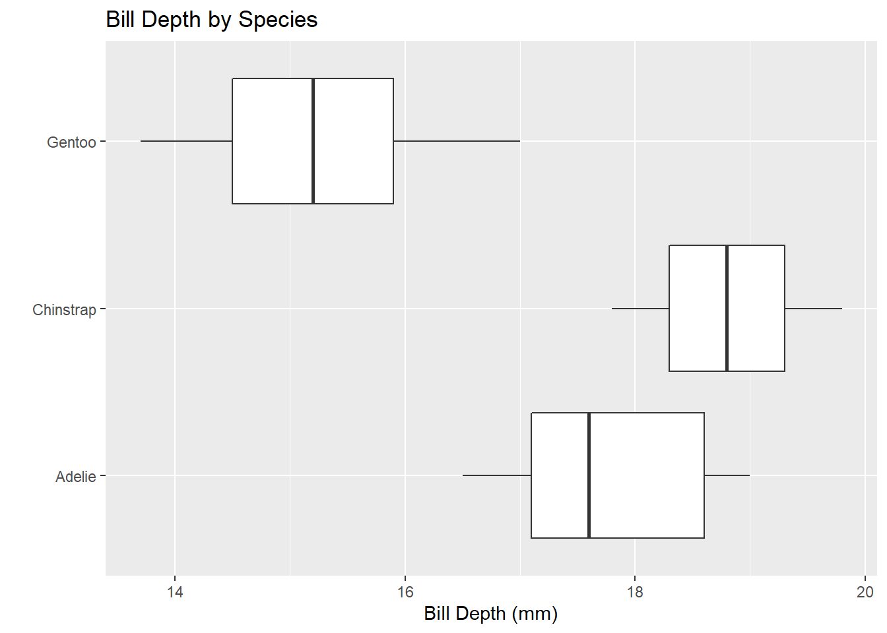

## Activity Objectives

This activity serves as an introduction to using R to interact with data. The purpose of this activity is to simply gain familiarity with using R to interact with data. After completing this activity, you'll have done the following:

1. Install and load packages/libraries in R.
2. Use the pipe operator (`%>%`) to chain commands together.
3. Use the `count()` function to create a frequency table for categorical variables.
4. Compute basic summary statistics with the use of `summarise()`.
5. Filter and subset data frames using the `filter()` and `select()` functions.
6. Group data with `group_by()` and compute summary statistics on groups.
7. Use `ggplot()` to display data graphically.

### Installing and Loading Packages

When we open R/RStudio, we have access to basic R functionality. Often, we'll want to extend that functionality to perform specialized tasks. Developers in the R community write and publish packages which can be installed and used by R-users. We install packages with `install.packages("package_name")` and load packages into our current R session with `library(package_name)`. While packages only need to be *installed* once, they must be loaded in each R Session you intend to use them in (**note:** an R Session begins when R/RStudio are opened and ends when they are closed or terminated). For example, you've already run `install.packages("palmerpenguins")` and `library(palmerpenguins)` to install and load the `palmerpenguins` package in your `PalmerPenguins_Initial` Quarto notebook. You won't need to run `install.packages("palmerpenguins:)` again, but you will need to re-load the library when we open our notebook again. 

+ Open an RStudio Session and then use `File -> Recent Projects` and select the `PalmerPenguinsAnalysis` project from the list to open it.
+ Open your `PalmerPenguins_Initial` notebook.
+ Rerun the lines of code you wrote in that notebook. As a reminder, you can run lines of code with `ctrl+Enter`, `cmd+Return`, or by hitting the green *play* button in the top-right corner of the code chunk.

### Reminder: Text and Narrative

Including a narrative alongside any analysis is extremely important. It is difficult for someone to simply read your code and immediately know what you are doing. Walking a reader through your thought process is helpful. As a reminder, Quarto notebooks allow you to mix R-code and text -- in general, code chunks appear with a grey background while text appears over a white background.

+ Add a new heading to your notebook, titled *Data Manipulation*.
+ Write a few sentences below the header to remind yourself that we'll be learning how to use R code to manipulate data in this section. In particular, we'll learn how to filter rows, subset columns, group data, and compute summary statistics.
+ Since you've seen the `head()` of the `penguins` data frame, create a bulleted list of questions you are interested in answering in your analysis.

### Data Manipulation and Summarization

There are some basic functions in R that are useful throughout any analysis. You'll be exposed to those here.

**Summarizing Data:** In the `penguins` data frame, we'll find recorded values of some numerical variables (variables for which a measure like the average is meaningful) and other variables which are categorical (grouping variables). We typically summarize categorical variables by counting the number of observations in each category -- often called a *frequency table*. We can build frequency tables in R with the `count()` function. For numerical variables, we have more options -- the `mean()` and `median()` are both measures of *average*, while we can use `sd()`, `IQR()`, and `quantile()` to measure spread.

*Counts for Categorical Data*:

+ We can create a frequency table for the `island` variable with the chain below. Create a new code cell in your Quarto notebook (remember, you can do this by typing a forward slash and choosing *R Code Chunk* from the list of options), and type/run the code to produce the frequency table.


::: {.cell}

```{.r .cell-code}
penguins %>%
  count(island)
```

::: {.cell-output .cell-output-stdout}
```
# A tibble: 3 × 2
  island        n
  <fct>     <int>
1 Biscoe      168
2 Dream       124
3 Torgersen    52
```
:::
:::


+ Interpret the output.
+ Open another code cell and compute a frequency table for the `species` variable. Interpret the output here as well.
+ What happens if you run `penguins %>% count(island, species)`? Run it in a new code cell and interpret the output.
+ ***Note:*** You can obtain a more readable version of the output from the call above using the following:

::: {.cell}

```{.r .cell-code}
penguins %>%
  count(island, species) %>%
  pivot_wider(names_from = species, values_from = n, values_fill = 0)
```

::: {.cell-output .cell-output-stdout}
```
# A tibble: 3 × 4
  island    Adelie Gentoo Chinstrap
  <fct>      <int>  <int>     <int>
1 Biscoe        44    124         0
2 Dream         56      0        68
3 Torgersen     52      0         0
```
:::
:::


+ ***Note 2:*** You can do *even* better if you run the code in the cell below. It requires that you install and load the `kableExtra` package though -- try it!

::: {.cell}

```{.r .cell-code}
penguins %>%
  count(island, species) %>%
  pivot_wider(names_from = species, values_from = n, values_fill = 0) %>%
  kable() %>%
  kable_styling(bootstrap_options = c("hover", "striped"))
```

::: {.cell-output-display}

`````{=html}
<table class="table table-hover table-striped" style="margin-left: auto; margin-right: auto;">
 <thead>
  <tr>
   <th style="text-align:left;"> island </th>
   <th style="text-align:right;"> Adelie </th>
   <th style="text-align:right;"> Gentoo </th>
   <th style="text-align:right;"> Chinstrap </th>
  </tr>
 </thead>
<tbody>
  <tr>
   <td style="text-align:left;"> Biscoe </td>
   <td style="text-align:right;"> 44 </td>
   <td style="text-align:right;"> 124 </td>
   <td style="text-align:right;"> 0 </td>
  </tr>
  <tr>
   <td style="text-align:left;"> Dream </td>
   <td style="text-align:right;"> 56 </td>
   <td style="text-align:right;"> 0 </td>
   <td style="text-align:right;"> 68 </td>
  </tr>
  <tr>
   <td style="text-align:left;"> Torgersen </td>
   <td style="text-align:right;"> 52 </td>
   <td style="text-align:right;"> 0 </td>
   <td style="text-align:right;"> 0 </td>
  </tr>
</tbody>
</table>

`````

:::
:::


*Summaries for Numerical Data*: As mentioned earlier, summaries for numerical data can include measures of *center*, *spread*, and other metric -- even those of our own invention!

+ We can compute the *average* (mean) bill length as follows:

::: {.cell}

```{.r .cell-code}
penguins %>%
  summarize(mean_bill_length_mm = mean(bill_length_mm))
```

::: {.cell-output .cell-output-stdout}
```
# A tibble: 1 × 1
  mean_bill_length_mm
                <dbl>
1                  NA
```
:::
:::

Oops -- there were missing values in there! This is a good opportunity to explain that *missing data is contagious* -- that means that if we try to compute a quantity, and some of the values are missing (`NA`), then the result will be `NA`. Let's try this again, but explicitly tell R that we want to ignore the `NA` values.

::: {.cell}

```{.r .cell-code}
penguins %>%
  summarize(mean_bill_length_mm = mean(bill_length_mm, na.rm = TRUE))
```

::: {.cell-output .cell-output-stdout}
```
# A tibble: 1 × 1
  mean_bill_length_mm
                <dbl>
1                43.9
```
:::
:::


That's better! Perhaps the mean alone, is not sufficient. Let's include the median, standard deviation, minimum, 25th percentile, 75th percentile, and maximum bill lengths as well.


::: {.cell}

```{.r .cell-code}
penguins %>%
  summarize(
    min_bill_length = min(bill_length_mm, na.rm = TRUE),
    first_quartile_bill_length = quantile(bill_length_mm, 0.25, na.rm = TRUE),
    median_bill_length = median(bill_length_mm, na.rm = TRUE),
    mean_bill_length_mm = mean(bill_length_mm, na.rm = TRUE),
    third_quartile_bill_length = quantile(bill_length_mm, 0.75, na.rm = TRUE),
    standard_deviation_bill_length = sd(bill_length_mm, na.rm = TRUE)
    ) %>%
  pivot_longer(cols = everything())
```

::: {.cell-output .cell-output-stdout}
```
# A tibble: 6 × 2
  name                           value
  <chr>                          <dbl>
1 min_bill_length                32.1 
2 first_quartile_bill_length     39.2 
3 median_bill_length             44.4 
4 mean_bill_length_mm            43.9 
5 third_quartile_bill_length     48.5 
6 standard_deviation_bill_length  5.46
```
:::
:::

The last line, `pivot_longer(cols = everything())` converts the table from being very *wide* to a more manageable *long* table. To see the benefit of doing this, remove the last line and the pipe (`%>%`) at the end of the previous line, then re-run the code chunk.

If you want a nicely formatted table, pipe the result into `kable()` as we did earlier. Just copy/paste what we did!

### Selecting Specific Columns and Rows

We don't have to work with the entire dataset. We can select specific columns (using the `select()` function) or rows satisfying certain conditions (using the `filter()` function).

+ For example, we can select only the `species`, `island`, `sex`, and `year` columns.


::: {.cell}

```{.r .cell-code}
penguins %>%
  select(species, island, sex, year)
```

::: {.cell-output .cell-output-stdout}
```
# A tibble: 344 × 4
   species island    sex     year
   <fct>   <fct>     <fct>  <int>
 1 Adelie  Torgersen male    2007
 2 Adelie  Torgersen female  2007
 3 Adelie  Torgersen female  2007
 4 Adelie  Torgersen <NA>    2007
 5 Adelie  Torgersen female  2007
 6 Adelie  Torgersen male    2007
 7 Adelie  Torgersen female  2007
 8 Adelie  Torgersen male    2007
 9 Adelie  Torgersen <NA>    2007
10 Adelie  Torgersen <NA>    2007
# … with 334 more rows
```
:::
:::


+ We can also `filter()` the dataset to include only `Chinstrap` penguins.


::: {.cell}

```{.r .cell-code}
penguins %>%
  select(species, island, sex, year) %>%
  filter(species == "Chinstrap")
```

::: {.cell-output .cell-output-stdout}
```
# A tibble: 68 × 4
   species   island sex     year
   <fct>     <fct>  <fct>  <int>
 1 Chinstrap Dream  female  2007
 2 Chinstrap Dream  male    2007
 3 Chinstrap Dream  male    2007
 4 Chinstrap Dream  female  2007
 5 Chinstrap Dream  male    2007
 6 Chinstrap Dream  female  2007
 7 Chinstrap Dream  female  2007
 8 Chinstrap Dream  male    2007
 9 Chinstrap Dream  female  2007
10 Chinstrap Dream  male    2007
# … with 58 more rows
```
:::
:::


Since we know that these are all `Chinstrap` penguins, perhaps we no longer need the `species` column. We can *de*-select it using the `select()` function and a minus (`-`) sign in front of the column name. We can also store this smaller data frame into a new object called `chinstraps` by using the arror (`<-`) operator.


::: {.cell}

```{.r .cell-code}
chinstraps <- penguins %>%
  select(species, island, sex, year) %>%
  filter(species == "Chinstrap") %>%
  select(-species)

chinstraps %>%
  head()
```

::: {.cell-output .cell-output-stdout}
```
# A tibble: 6 × 3
  island sex     year
  <fct>  <fct>  <int>
1 Dream  female  2007
2 Dream  male    2007
3 Dream  male    2007
4 Dream  female  2007
5 Dream  male    2007
6 Dream  female  2007
```
:::
:::


### Grouping and Summarizing Groups

We can use `group_by()` and `summarize()` to quickly compare summary statistics across groups. Let's compare the average and standard deviation in `bill_depth_mm` across the species groups.


::: {.cell}

```{.r .cell-code}
penguins %>%
  group_by(species) %>%
  summarise(
    mean_bill_depth_mm = mean(bill_depth_mm, na.rm = TRUE),
    sd_bill_depth_mm = sd(bill_depth_mm, na.rm = TRUE)
  )
```

::: {.cell-output .cell-output-stdout}
```
# A tibble: 3 × 3
  species   mean_bill_depth_mm sd_bill_depth_mm
  <fct>                  <dbl>            <dbl>
1 Adelie                  18.3            1.22 
2 Chinstrap               18.4            1.14 
3 Gentoo                  15.0            0.981
```
:::
:::


What do you notice? Add this code to your notebook, run it, and include an interpretation of the results.

### Data Visualization with `ggplot()`

There are entire courses on data visualization. We'll give you just a taste of it here. 

**One Categorical Variable:** We can visualize a categorical variable with a barplot.

::: {.cell}

```{.r .cell-code}
penguins %>%
  ggplot() +
  geom_bar(mapping = aes(x = species)) +
  labs(title ="Counts of Penguin Species",
       x = "Species", y = "Count")
```

::: {.cell-output-display}
{width=672}
:::
:::

  
+ Add this plot to your notebook and include a discussion of it.
+ Create a new plot visualizing one of the other categorical variables in the dataset and discuss it.

**One Numerical Variable:** We can visualize a single numerical variable with a histogram (`geom_histogram()`), density (`geom_density()`), or boxplot (`geom_boxplot()`).

::: {.cell}

```{.r .cell-code}
penguins %>%
  ggplot() +
  geom_histogram(mapping = aes(x = bill_length_mm),
                 color = "white",
                 fill = "blue") +
  labs(title ="Distribution of Bill Lengths",
       x = "Bill Length (mm)", y = "Count")
```

::: {.cell-output .cell-output-stderr}
```
`stat_bin()` using `bins = 30`. Pick better value with `binwidth`.
```
:::

::: {.cell-output .cell-output-stderr}
```
Warning: Removed 2 rows containing non-finite values (stat_bin).
```
:::

::: {.cell-output-display}
{width=672}
:::
:::

  
  + Add this plot to your notebook and include a discussion of it.
  + Change the plot above to a density or boxplot. What does your new plot do a better job showing than the histogram? What did the histogram do better?
  
**Two Numerical Variables:** We can explore a potential relationship between two numerical variables with a scatterplot.

::: {.cell}

```{.r .cell-code}
penguins %>%
  ggplot() +
  geom_point(mapping = aes(x = bill_depth_mm, y = bill_length_mm)) +
  labs(title = "Bill Depth and Length",
       x = "Bill Depth (mm)",
       y = "Bill Length (mm)")
```

::: {.cell-output .cell-output-stderr}
```
Warning: Removed 2 rows containing missing values (geom_point).
```
:::

::: {.cell-output-display}
{width=672}
:::
:::


+ Add this plot to your notebook.
+ Do you notice anything interesting? Write about it!
+ Build another scatterplot to explore a potential association you are interested in.

**Two Categorical Variables:** We can explore potential associations between pairs of categorical variables using barplots and fill.

::: {.cell}

```{.r .cell-code}
penguins %>%
  ggplot() +
  geom_bar(mapping = aes(x = island, fill = species)) +
  labs(title = "Species by Island",
       x = "Island",
       y = "Species")
```

::: {.cell-output-display}
{width=672}
:::
:::


+ Add the plot to your notebook and discuss it.

**One Numerical and One Categorical Variable:** Effective visualizations to compare a numerical variable and a categorical variable include side-by-side boxplots, or faceted plots.

::: {.cell}

```{.r .cell-code}
penguins %>%
  ggplot() +
  geom_boxplot(mapping = aes(x = bill_depth_mm, y = species)) +
  labs(title = "Bill Depth by Species",
       x = "Bill Depth (mm)",
       y = "")
```

::: {.cell-output-display}
{width=672}
:::

```{.r .cell-code}
penguins %>%
  ggplot() +
  geom_histogram(mapping = aes(x = bill_depth_mm)) +
  facet_wrap(~species, ncol = 1) +
  labs(title = "Bill Depth by Species",
       x = "Bill Depth (mm)",
       y = "")
```

::: {.cell-output-display}
{width=672}
:::
:::


+ Add these plots to your notebook and interpret what you are seeing.

### Advanced Plotting

Once you get comfortable with basic `ggplot()` syntax, it is quite easy to build more complex plots. For example, see the plot below.


::: {.cell}

```{.r .cell-code}
penguins %>%
  filter(!is.na(sex)) %>%
  ggplot() +
  geom_point(mapping = aes(x = bill_length_mm, 
                           y = flipper_length_mm,
                           color = species,
                           shape = sex)) +
  geom_smooth(mapping = aes(x = bill_length_mm,
                            y = flipper_length_mm,
                            color = species)) +
  facet_grid(rows = vars(island), cols = vars(sex), scales = "free") +
  labs(title = "Flipper and Bill Lengths by Species and Sex",
       x = "Bill Length (mm)",
       y = "Flipper Length(mm)") +
  theme_light()
```

::: {.cell-output .cell-output-stderr}
```
`geom_smooth()` using method = 'loess' and formula 'y ~ x'
```
:::

::: {.cell-output-display}
{width=672}
:::
:::


## Summary

Throughout this activity, you had your first exposure to using R to interact with data. You learned how to manipulate data in a tabular format using selector functions like `select()` and `filter()`. You learned how to compute summary statistics for both categorical and numerical data. Finally, you learned how to display data visually with `ggplot()`.

## Finishing Up

+ Revisit the questions of interest you had at the beginning of this notebook. If there are any that remain unanswered, try answering them with the use of your new data superpowers! 
+ Once you are done, use the blue *Render* button to build your notebook.
+ Click on the `Git` tab in the top-right pane of RStudio. 
+ Click on the blue *Pull* arrow to pull in all of the most updates to your *origin* repository.
+ Click the check boxes next to all of your changed files
+ Click the *Commit* button, add a commit message about what we've done here, then click to *Commit*.
+ Finally, *Push* your changes out to GitHub using the green *Push* arrow.


